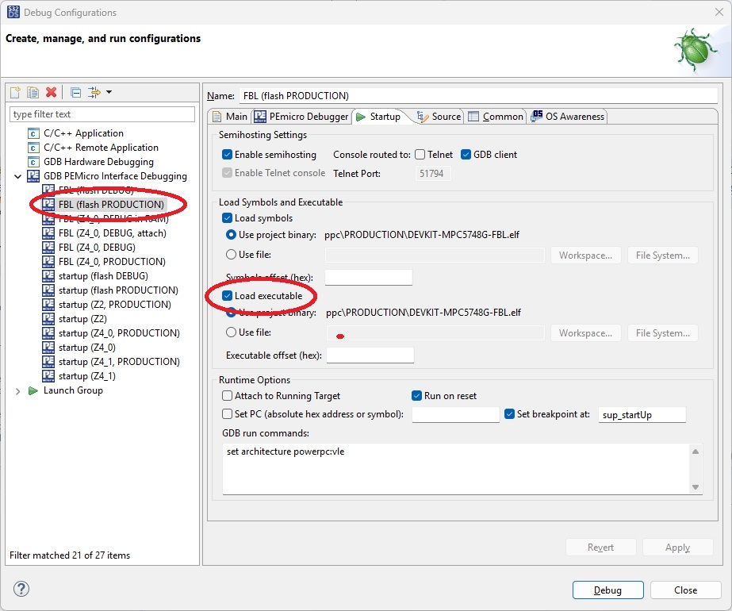

= Flash Boot Loader for MPC5748G
:Author:            Peter Vranken
:Email:             mailto:Peter_Vranken@Yahoo.de
:toc:               left
:xrefstyle:         short
:numbered:
:icons:             font
:caution-caption:   :fire:
:important-caption: :exclamation:
:note-caption:      :paperclip:
:tip-caption:       :bulb:
:warning-caption:   :warning:

This repository contains a CAN based flash boot loader (FBL) for the
DEVKIT-MPC5748G. The board dependencies are little, so the FBL will be
applicable in other boards designed around the MPC5748G, too.

The FBL supports CAN as only communication channel. The applied protocol
is CCP, details are explained below. A suitable
https://github.com/PeterVranken/winFlashTool/tree/main[flash tool^] is
available in a related repository. It has been made for Windows, but it is
a Java application and should run under Linux, too.

== Key features

- CCP protocol for authorization, erasure, download (programming) and
  upload (read-out or verify).
- Authorization with Ed25519 key pairs.
- 224 kB at 0xF90000 reserved for FBL.
- 5856 kB at 0xFC8000 managed by FBL and available to application code.
- Entry into FBL by software reset or by programmable time span to wait
  for a CCP CONNECT after reset.

== Usefulness of this repository

The FBL is applicable out of the box only, if:

- The platform is the DEVKIT-MPC5748G.
- The related flash tool is used.
- Entry into the FBL for re-programming the application is desired only
  out of reset.

In all other situations, the repository can be understood only as starting
point of your own development:

- If you use another board with the MPC5748G, then you'd probably need to
  rework the CAN driver configuration, the driver for the CAN transceiver
  and the pin configuration for the chosen CAN device.
- If you use another MCU from the same NXP family and if it has the C55FMC
  flash memory then you also need to add a new specification table of
  flash blocks and modify the addresses, where the FBL resides in memory,
  where the application may reside and where the boot header is placed.
  (Besides all the general migration work for another MCU, like startup
  code, clock settings, etc.)
- If you use another MCU from the same NXP family and if it doesn't have
  the C55FMC flash memory then you also need to add a new flash ROM
  driver, which supports erasure of blocks and programming of pages.

The first scenario can be considered a small, simple, and quick change.
The others represent a serious development project.

== Abbreviations

[frame="all",width="70%",options="header",cols="^30%,70%"]
|=======
|Abbreviation |Meaning

//|ADC |Analog-digital converter
//|aka |Also known as
//|API |Application programming interface
//|APSW |Application software
|BAF |Boot assist flash
//|BCC |Basic conformance class
//|BSW |Basic software
|CAN |Controller area network
|CCP |CAN calibration protocol
|COM |Communications port
//|CPU |Central processing unit
|CRO |Command receive object
|DTO |Data Transmission Object
//|FD |Flexible data-rate
|FBL |Flash boot loader
|GCC |GNU compiler collection
|GPIO |General purpose I/O
|GNU |GNU's not Unix
|GUI |Graphical user interface
//|HW |Hardware
|I/O |Input/output
|ID |Identifier
|IDE |Integrated development environment
//|IP |Internet protocol
//|IRQ |Interrupt request
//|ISR |Interrupt service routine
//|LED |Light-emitting diode
|MCU |Microcontroller unit
|MTA |Memory transfer address
//|MMU |Memory management unit
//|MPU |Memory protection unit
//|NVM |Non-volatile memory
//|OS |Operating system
|PC |Personal computer
//|PCP |Priority ceiling protocol
|RAM |Random access memory
|ROM |Read only memory
//|RTOS |Real time operating system
|Rx |Inbound, reception related
//|SDA |Small data area
//|SD |Secure Digital
//|SPI |Serial peripheral interface
//|SPR |Special purpose register
|SW |Software
//|TBC |To be checked
//|TBD |To be defined
//|TCP |Transmission Control Protocol
|TODOC |To be documented
|Tx |Outbound, transmission/send related
//|UDP |User datagram protocol
//|UDS |Unified diagnostic services
|USB |Universal serial bus
//|XCP |Universal measurement and calibration protocol
//|XML |Extensible markup language
|=======

== The FBL

The FBL is an ordinary, embedded application for the MPC5748G. It has a
CAN device driver and a flash ROM driver. It integrates elements from the
Open Source CAN stack
https://github.com/PeterVranken/comFramework/wiki[comFramework^] to
implement the
https://kvaser.com/about-can/higher-layer-protocols/ccpxcp/[CCP
protocol^].

The CCP protocol permits another CAN node -- usually a Windows flash tool
-- to establish a communication channel (aka "session") with the
DEVKIT-MPC5748G. The DEVKIT-MPC5748G is the CCP server and the Windows
flash tool is the CCP client. The server provides functionality and the
client can use CCP commands to configure and initiate the execution of the
offered functions.

The basic idea of CCP is a pair of two CAN messages, called CRO and DTO.
The client sends a CRO message, which encodes a CCP command, including its
arguments. The client decodes the command, executes it and sends the DTO
message back, which encodes the result of the command execution. The core
code structure of the FBL is a state machine implementing the CCP
protocol. Actions are triggered on reception of CAN CRO messages and when
they complete, a DTO message is sent.

The FBL supports only a subset of all CCP commands -- those which are
required for flashing an application (see below). The principal CCP
commands are erasing flash memory blocks and downloading data bytes for
programming. If the client uses unsupported CCP commands then the FBL will
reject them and terminate the session.

Many of the triggered actions are activities of the flash ROM driver,
e.g., erasing a flash block or programming a flash ROM page. The flash ROM
driver executes in parallel to the CCP state machine. The CCP state
machine is not only triggered by CAN Rx events, but it has timer events
available, too, which allow it to regularly check for the progress of the
concurrent flash ROM driver or to decide on timeout and failure if it is
not responsive. It also checks for potential misbehavior of the CCP
client, which is perceived as protocol error and leads to termination of
the session.

Next to CCP protocol state machine and flash ROM driver, is the serial I/O
the third pillar in the code structure. The FBL writes a lot of status and
progress information to the COM port of the DEVKIT-MPC5748G. Moreover, it
reads a couple of commands ("help" to begin) from the COM port and allows
to interact with a user, who has opened a terminal session with the board.
This option strongly supports all development work in the context of the
FBL -- be it maintenance work on the FBL itself or development of an
application made or modified for use with the FBL. Beyond development, in
the final product, the serial I/O has no relevance any more.

The FBL occupies a portion of the application flash ROM of the MPC5748G.
Actually, it requires:

.Flash ROM reserved for FBL
[quote]
----
0x00F90000 .. 0x00FC8000 (224 kB)
----

This address range is not available for a flashed application. The
remaining application flash ROM,

.Flash ROM managed by the FBL
[quote]
----
0x00FC8000 .. 0x01580000 (5856 kB, 5.72 MB)
----

can be used for the application. The FBL can erase and re-program this
memory area. The FBL is not able to erase, access or program any other
part of the memories.

In a typical scenario, the FBL is flashed once onto the DEVKIT-MPC5748G
with the debugger in the S32 Design Studio. From now on, the application
and all of its later updates will be flashed with a Windows flash tool and
under control of the FBL. This supports making products based on the
MPC5748G, which allow later firmware update in the workshop or a customer
support center.

== Configuration of CAN bus and CAN IDs

Flashing is done by CAN using the CCP protocol. CCP requires two CAN
messages, the CRO command message and the DTO response message. The
FBL requires the configuration of the CAN device to use and the two CAN
IDs for CRO and DTO. The choice is made at compile-time by means of
`#define` switches in file `code/system/CCP/ccp_taskCcp.h`.

Other CAN related configuration settings, like Baud rate are not FBL
specific. They are configured in the CAN driver configuration. See file
`code/system/drivers/CAN/cdr_canDriver.config.inc` and visit
DEVKIT-MPC5748G sample
https://github.com/PeterVranken/DEVKIT-MPC5748G/tree/master/samples/CAN[`CAN`^]
for details.

The FBL can basically use any CAN bus for flashing. The configuration made
in the repository is the CAN bus, which is connected to the CAN
transceiver mounted on the DEVKIT-MPC5748G and you can use the FBL out of
the box.

The configuration setting is found as macro `CCP_IDX_CAN_BUS_FOR_CCP`:

[source,C++]
---------------------------
/** The CAN bus by zero based index, which should be used for CCP
    communication. */
#define CCP_IDX_CAN_BUS_FOR_CCP         cdr_canDev_CAN_0
---------------------------

`cdr_canDev_CAN_0` designates the first FlexCAN device, which is enabled
in the CAN driver `code\system\drivers\CAN`. In the uploaded revision,
this is `FlexCAN_0`. If you want to use another CAN device for the FBL,
then you first need to modify the CAN driver configuration and enable
and configure that device properly.

The CAN IDs are set by means of `#define` switches in
file `code/system/CCP/ccp_taskCcp.h`:

[source,C++]
---------------------------
/** The CAN ID of the CCP Rx command message, aka CRO message. */
#define CCP_CAN_ID_CCP_CRO_MSG          0x600u

/** Boolean: Is the CAN ID of the CCP CRO message a 29 Bit extended ID? */
#define CCP_IS_EXT_CAN_ID_CCP_CRO_MSG   false

/** The CAN ID of the CCP Tx response message, aka DTO message. */
#define CCP_CAN_ID_CCP_DTO_MSG          0x650u

/** Boolean: Is the CAN ID of the CCP DTO message a 29 Bit extended ID? */
#define CCP_IS_EXT_CAN_ID_CCP_DTO_MSG   false
---------------------------

Can can choose any ID and switch between 11 and 29 Bit IDs.

== Configuration of CCP station address

More than one CCP server can be connected to a CAN bus. (Only one at a
time can communicate with a CCP client.) The CCP client starts the
communication with a server by addressing to the right device and the
identification of a CCP server is called "station address". The station
address of the FBL is a compile-time configuration setting, which is set
by means of `#define` switch in file `code/system/CCP/ccp_taskCcp.h`:

[source,C++]
---------------------------
/** The 16 Bit station address of the ECU. This value is addressed to in
    the CCP CONNECT command. */
#define CCP_STATION_ADDR                0x1234u
---------------------------

The default configuration is 0x1234 or 4660. This address needs to be used
in the configuration of the flash tool.

== Authentication key pair

The FBL allows memory access for upload or download and programming only
after successful authentication. An Ed25519 key pair is used for this
purpose. The keys both have a length of 32 Byte. (The private key is
sometimes stored together with the public key, so that its representation
has 64 Byte length.)

The public key is a compile-time configuration setting of the
FBL. It is configured as a constant array in file
`code/system/digitalSignature/tds_taskDigSignature.c`:

[source,C++]
---------------------------
/** The public key of the authentication procedure. */
static const uint8_t RODATA(_publicKey)[32] =
{ 0x03u, 0xA1u, 0x07u, 0xBFu, 0xF3u, 0xCEu, 0x10u, 0xBEu,
  0x1Du, 0x70u, 0xDDu, 0x18u, 0xE7u, 0x4Bu, 0xC0u, 0x99u,
  0x67u, 0xE4u, 0xD6u, 0x30u, 0x9Bu, 0xA5u, 0x0Du, 0x5Fu,
  0x1Du, 0xDCu, 0x86u, 0x64u, 0x12u, 0x55u, 0x31u, 0xB8u,
};
---------------------------

The default key in the uploaded source file fits to the trivial private
key 0, 1, 2, ..., 31.

If the flash tool uses this private key then it can directly connect to
the FBL. The related
https://github.com/PeterVranken/winFlashTool/tree/main[flash tool^]
supports this private key out of the box, so that immediate usability of
the FBL is granted. Any true application of the FBL will require another
key pair. The related flash tool has an option to generated new, randomly
chosen key pairs. Any other key pair generator for Ed25519 can of course
be used, too.

As of writing, April 2026, there is no compile-time switch in the FBL to
disable the authentication procedure.

== Supported CCP commands

Only a small subset of CCP commands is required for the tasks of an FBL.
This FBL understands:

// See https://docs.asciidoctor.org/asciidoc/latest/tables/build-a-basic-table/ or https://leanpub.com/awesomeasciidoctornotebook/read
// frame: top, bottom, topbot, all (default), sides, none
// grid: all (default), none, maybe more
// styles (use <char>| for a single cell, e.g. a|):
//   e: emphasized
//   a: Asciidoc markup
//   m: monospace
//   h: header style, all column values are styled as header
//   s: strong
//   l: literal, text is shown in monospace font and line breaks are kept
//   d: default
//   v: verse, keeps line breaks
// format="csv": Cell comma separated (no leading/trailing comma)
[[tabSupportedCCP]]
.Supported CCP commands
[options="header",cols="^25e,^10e,65e", width="90%"]
|=======
|CCP |Code |Description

|CONNECT |0x01 | Establish a CCP connection with a particular device. The
station address is the argument of the command. Pass 0x1234 to address to
our FBL.

|SET_MTA |0x02 | The target address for erasure, up- and download is set.
Argument is the address. CCP specifies two addresses, which can be set.
The FBL supports only `MTA0`. Any attempt to set `MTA1` or to set `MTA0`
to an address not in the managed flash ROM (exception see below) leads to
a negative response.

|UPLOAD |0x04 | Argument is a count in the range 1..5. This
number of bytes is read at memory address `MTA0` and returned in the
response. MTA is incremented by the requested number of bytes.

|DOWNLOAD |0x03 | Argument is a number of data bytes in the range 1..5.
These bytes are written to the RAM address `MTA0`. The only use of this
command is downloading the digital signature for authentication. The MTA
is incremented by the number of bytes.

|DOWNLOAD_6 |0x23 | Nearly same as DOWNLOAD. While DOWNLOAD has the count
of data bytes as an argument, does this command download exactly six data
bytes.

|CLEAR_MEMORY |0x10 | Erase flash ROM. Argument is the number of bytes to
erase, starting from flash ROM address `MTA0`. Effectively, the command can
erase more data bytes; first and last address are rounded down and up,
respectively, to the next flash block start address. (Only complete flash
blocks can be erased.)

This command is different in that it can take very long to respond. The
response is sent only after erasure has completed. If the entire managed
flash ROM is erased then this takes about 15 s. The CCP client needs to
have an according timeout, when submitting this command.

|PROGRAM |0x18 | Argument is a number of data bytes in the range 1..5.
These bytes are programmed at flash ROM address `MTA0`. The MTA
is incremented by the number of bytes.

|PROGRAM_6 |0x22 | Nearly same as PROGRAM. While PROGRAM has the count of
data bytes as an argument, does this command program exactly six data
bytes.

|DIAG_SERVICE |0x20 | This command supports custom functionality of a CCP
server. Argument is the index of the function and up to four argument
bytes. The response contains the size of the function result in Byte. `MTA0`
is set to the upload address for the function result. The FBL supports
these custom functions:

0: Request a seed for the authentication. Function result is the 4-Byte
seed value plus the RAM address, where to download the digital signature
of the seed value.

1: Get the version information of the FBL. Function result is a text
string.

2: Reset the ECU. After reset, the FBL is unconditionally entered (again),
regardless whether a valid application is flashed or not. Note, the reset
is delayed for a few Milliseconds, so that the CCP client can still submit
the `DISCONNECT` command for graceful termination of the communication.

8: Reset the ECU. After reset, the FBL checks for a flashed, valid
application. If found, it immediately launches the application, i.e.,
without (shortly) waiting for a potential CCP `CONNECT` command. Note, the
reset is delayed for a few Milliseconds, so that the CCP client can still
submit the `DISCONNECT` command for graceful termination of the
communication.

|DISCONNECT |0x07 |The CCP connection is closed. The FBL remains active
and will properly respond to a new CCP `CONNECT` command at its station
address.
|=======

[[secCcpCmdSeqs]]
== Typical CCP command sequences

The CCP commands can't be used in arbitrary way and order.

Some of the constraints:

- None of the commands will succeed if the authentication procedure hasn't
been completed before. The authentication is valid as long as the session
is alive, i.e., until an explicit `DISCONNECT` or until an error occurs.
- `CLEAR_MEMORY`, `UPLOAD`, `DOWNLOAD`, `DOWNLOAD_6`, `PROGRAM` and
`PROGRAM_6` do all depend on `MTA0`, normally set by an initial `SET_MTA`.
- Erasure is always done for entire flash blocks and it is a long lasting
operation (up to 15 s). It makes little sense to erase small chunks of
data or to alternatingly erase and program data if not carefully
considering the flash block boundaries. Otherwise a later `CLEAR_MEMORY`
can easily destroy the result of an earlier `PROGRAM`.
- Flash ROM can be programmed only if it is blank. A `PROGRAM` or
`PROGRAM_6` will fail with almost certainty, if it is not preceded by a
successful `CLEAR_MEMORY` of the same address range.
- The organization of the flash ROM in so-called "quad-pages" of 128 Byte
and the aligned buffering strategy of the FBL make `PROGRAM` and
`PROGRAM_6` commands fail with high likelihood if the CCP doesn't send the
data in order of monotonic raising addresses.
- An ECU reset command should be followed very soon by a `DISCONNECT` if
the client wants a graceful termination of the session. The FBL waits a
few Milliseconds until it resets the ECU.
- Most of the time, a `DISCONNECT` without preceding ECU reset command is
pointless -- the FBL would remain active and enter the
wait-for-CCP-connect loop.
- The FBL has a session timeout of 5 s. The CCP client must not wait
longer than 5 s to submit a CCP command after it got the response from the
previous one.

Some typical use cases and resulting sequences follow up in the next
sections.

=== Connection test

. `CONNECT`, station address is 0x1234.
. `DIAG_SERVICE`, function 0, request seed for authentication.
. Two times `UPLOAD` to fetch the function result, the seed value and the
download address for the computed digital signature.
. Several `DOWNLOAD_6` and or `DOWNLOAD` commands to provide the 64 Byte
of the computed digital signature of the seed to the FBL.
. `DIAG_SERVICE`, function 1, request version information.
. Several `UPLOAD` commands to fetch the function result, the version
information. (Natural, printable text; no specific data format is
involved.)
. `DISCONNECT`.

=== Upload memory contents

Upload of memory contents is typically applied for a verification process,
e.g. after flashing new data.

. `CONNECT`, station address is 0x1234.
. `DIAG_SERVICE`, function 0, request seed for authentication.
. Two times `UPLOAD` to fetch the function result, the seed value and the
download address for the computed digital signature.
. Several `DOWNLOAD_6` and or `DOWNLOAD` commands to provide the 64 Byte
of the computed digital signature of the seed to the FBL.
. `SET_MTA`, argument is the first flash ROM address to read.
. Several `UPLOAD` commands to fetch all wanted bytes from the ECU.
. `DISCONNECT`.

=== Full, normal application flash procedure

Upload of memory contents is typically applied for a verification process,
e.g. after flashing new data.

. `CONNECT`, station address is 0x1234.
. `DIAG_SERVICE`, function 0, request seed for authentication.
. Two times `UPLOAD` to fetch the function result, the seed value and the
download address for the computed digital signature.
. Several `DOWNLOAD_6` and or `DOWNLOAD` commands to provide the 64 Byte
of the computed digital signature of the seed to the FBL.
. `SET_MTA`, argument is the first flash ROM address to program.
. `CLEAR_MEMORY`, argument is the difference between last (exclusive) and
first flash ROM address to program.
. Several `PROGRAM_6` and or `PROGRAM` commands to write all wanted bytes
into the blank flash ROM.
. `SET_MTA`, argument is the first programmed flash ROM address.
. Several `UPLOAD` commands to fetch all just programmed bytes from the
ECU for verification.
. `DIAG_SERVICE`, function 8, reset of ECU with immediate launch of just
flashed application.
. `DISCONNECT`.

== Error responses

Any CCP command ends with a CAN response message. The most important
element of the response is the Command Return Code - normally the success
message 0. All non-zero return codes designate a kind of error. No matter
which error, the flash procedure has failed whenever such a non-zero code
is sent back to the client.

When sending a non-zero return code, the FBL always closes the connection.
The client should do the same and can then try to re-connect and start
over.

Several CCP commands are executed asynchronously to the CCP protocol flow.
This means the CCP command just initiates the requested operation and the
response is sent back before the operation has completed. Evidently, the
response can't contain the success or error message from the operation.
Whenever this happens, a potential failure of the operation is returned as
non-zero return code of the first CCP command after completion of the
operation. Therefore, it can be hard to relate a non-zero return code to
the failing CCP command. Which doesn't really matter in practice --
whenever a command fails, the intended procedure -- be it a verify,
erasure or application programming -- has failed and the session is closed
and the CCP client can try to repeat the entire procedure. Continuation of
data flashing after error analysis would anyway be unlikely to succeed due
to the characteristics of the flash ROM.

Asynchronous function execution mainly relates to programming: When the FBL
receives a `PROGRAM` or `PROGRAM_6` command, it will first buffer the data
and only later do the actual flash programming.

== Data buffering during programming

The CCP client must send the data to program in order of raising memory
addresses. The flash ROM is organized in pages of 128 Byte (called
"quad-pages" for the MPC5748G) and only entire pages can be programmed.
Once a page has been programmed, it is not possible to program it again,
regardless whether the same or other bytes of the page are programmed.
Before a page can be programmed again, the entire flash block containing the
page needs to be erased again -- and this will erase many other pages at
the same time. (For the MPC5748G, a flash block consists of 2048 pages.)

The CCP commands allow to download only up to six bytes for programming.
Therefore, the FBL has a buffering strategy to collect downloaded bytes
until a complete page has been downloaded. Only then, the page is
programmed as a whole. Writing a page is triggered implicitly as soon as a
CCP `PROGRAM` or `PROGRAM_6` command addresses a byte belonging into
another quad-page. Given this strategy, the easiest way to safely write
all bytes of all quad-pages is sending them in order of raising addresses.
A back and force between programmed addresses is not impossible but would
require deep understanding of the buffering strategy and it would require
to strictly consider the quad-page boundaries.

== Console I/O

During development of either the FBL itself or a compatible application of
the DEVKIT-MPC5748G, it is recommended to make use of the console
interface of the FBL.

The USB connection between DEVKIT-MPC5748G and the PC used for development
(Windows or Linux) provides a virtual COM device. Open a terminal
application on your PC, which the evaluation board is connected to via
USB. The NXP software implements a virtual COM device on the PC,
which is called "OpenSDA - CDC Serial Port". (Use the Windows GUI
"Computer Management", tab `System Tools/Device Manager` to find out.). In
the terminal application, open this COM channel with 115200 Bd, 8 Bit, no
parity bit, 1 stop bit. End of line, for in- and output, is the
combination of carriage return and newline, 0x0D 0x0A.

The information printed to the console is useful to understand, what the
FBL does do. You can see if a CCP client tries to connect, if the
connection is established, if and why it is terminated and so on.
Moreover, the reset behavior with or without launching an application is
protocoled.

There are a few possibilities to interact with the FBL, too, which may be
useful to understand the FBL and to support development. Type `help` in
your terminal application to see.

[[secResetBehavior]]
== Reset behavior

The FBL knows three different reset behaviors:

1. The undecided reset. Most of the time a power-on reset of the board.
In this case, the FBL checks the memories for a flashed, valid application.
If it finds a valid boot header then this header contains a time
designation. The FBL starts entirely up, opens the CAN device and listens
for potential CCP `CONNECT` commands at its station address. A CCP client
has the opportunity to send such a command and to begin some CCP
communication, e.g., one of those typical command sequences explained
<<secCcpCmdSeqs,above>>.
+
The time designation from the boot header limits the time, the FBL waits
for such a potential command. The time is specified in Milliseconds and
the maximum possible value is one Minute. If this time elapses without
receiving a valid CCP `CONNECT` then the FBL launches the flashed
application. It uses reset type 2 to do so.
+
Listing for CCP `CONNECT` is an option only. The time designation can be
zero. In this case, reset 1 behaves like reset 2 and the startup time
for a flashed, valid application is significantly shorter; it is
nearly identical to the use of the application without FBL. Please note
that the application needs to support reset 3 in this case, otherwise,
the FBL would become useless.
+
If the FBL doesn't find a valid boot header then it behaves as if the time
designation were infinite; it listens forever for CCP `CONNECT` commands.

2. The reset to launch the application. This is a SW reset, normally
triggered by the FBL itself, on demand of a connected CCP client.
+
In this case, the FBL checks the memories for a flashed, valid application.
If it finds a valid boot header then this header contains the start
address of the application. The FBL launches the application by direct
jump to that address. This is possible because at this time the FBL has
made only the minimal HW setup needed to run code: CPU, RAM and very
basically the clock system - but nothing, which wouldn't be overruled
anyway by any flashed application and, in particular, nothing which
couldn't be undone by an application, like one-time configurations.
+
If the FBL doesn't find a valid boot header then it starts fully up, opens
the CAN device and listens for CCP `CONNECT` commands -- this time forever,
without time limits.

3. The reset to launch the FBL. This is a SW reset, normally triggered by
the flashed application. An application made for use with the FBL can
implement some communication with its user, that allows the user to start
the FBL. (A typical application function could be titled "Update firmware"
or similar. It could be triggered by CAN or by a specific high-low
combination of a few GPIO pins, or whatever.)
+
The FBL can trigger this kind of reset itself, but besides demonstration
and development support, there is no true use-case for this. A connected
CCP client can demand the reset. An application, which wants to support
this feature needs to implement the same or equivalent code as the FBL for
triggering the reset, please see next section for details.

Most of the time, during normal use of a DEVKIT-MPC5748G application,
reset 1 is used. The board is powered, the application launched, the user
experiences expected behavior of board and application.

Reset 2 is normally used only at the end of a successful CCP communication
sequence, which was initiated to flash an update of the application onto
the board: The new application is started without the need for re-powering
the board.

Reset 3 allows convenient firmware update of the board. In particular if
the application supports CAN communication and if the trigger for this
reset can be demanded by CAN then a customized flash tool can first
CAN-communicate with the application, demand reset 3 and can then start
the CCP communication with the meanwhile started FBL for re-programming
the application. The entire process "Update firmware" appears to the user
as a simple, solid operation.

=== How to trigger reset 3 from an application

To trigger a software reset, the application needs to run in supervisor
mode. The Mode Entry Module (`MC_ME`) has the control register
`MC_ME_MCTL`, which can written to request a transition into mode "RESET".
See the reference manual of the MPC5748G, section 38, for details.

The FBL specific aspect is a command flag, which is written into RAM at
known address. The RAM contents are not modified by the software reset and
the startup code of the FBL can evaluate the flag after the reset. The
application needs to:

1. Suspend all interrupts.
2. Write the magic word 0xDEADBEEF into the first 32 Bit word at the
beginning of the used RAM, i.e., at 0x40000000.
3. Write the command flag into the next 32 Bit address, i.e., at
0x40000004. The command flag to go into and remain in the FBL after reset
is 0xADEAFBEE.
4. Command the mode transition into RESET at the Mode Entry Module.

Suspending all interrupts is important insofar as otherwise the RAM
manipulation in the next steps can have any unforeseen harmful effect if
some other code entity would still execute. An alternative would be
ensuring by memory partitioning that the first 8 Byte of RAM are never and
nowhere used in the application.

Here is how the FBL implements it (file
`code/system/drivers/boot/swr_softwareReset.c`):

[source,C++]
---------------------------
/**
 * Trigger a functional (software-)reset.
 *   @param[in] bootFlag
 * A 32 Bit word, which is passed to the FBL across the demanded reset.
 * Must be either #SWR_BOOT_FLAG_START_FBL (0xADEAFBEE) or
 * #SWR_BOOT_FLAG_START_APP (0x31415927).
 */
void swr_osSoftwareReset(uint32_t bootFlag)
{
    /* Only allowing the two flags is a restriction of the FBL itself. The
       reset and startup code allows any value >= 0x10. (The lower numbers
       are reserved for error codes.) */
    assert(bootFlag == SWR_BOOT_FLAG_START_FBL
           ||  bootFlag == SWR_BOOT_FLAG_START_APP
          );

    /* Restart the application by reset. The information, whether and what
       to start is passed in SRAM to the FBL across the reset. The startup
       code of the FBL will evaluate the SRAM location. */
    rtos_osSuspendAllInterrupts();

    /* Write arguments of reset at hard-coded address into RAM. We must do
       this only after suspending all IRQ handling, because we may corrupt
       the memories of some other part of the SW. No other piece of SW
       must ever get the chance to execute once we get here. */
    extern const uint8_t const ld_memRamStart[0];
    uint32_t *pResetInfo = (uint32_t*)ld_memRamStart;
    * pResetInfo++ = SWR_MAGIC_IS_BOOT_FLAG_VALID;
    * pResetInfo   = bootFlag;

#if defined(MCU_MPC5748G)
    /* Request mode transition to RESET mode (0x0) by write of key,
       followed by inverted key. RM48 38.3.2, pp.1096f. */
    MC_ME->MCTL = MC_ME_MCTL_TARGET_MODE(0x0) | MC_ME_MCTL_KEY(0x5AF0);
    MC_ME->MCTL = MC_ME_MCTL_TARGET_MODE(0x0) | MC_ME_MCTL_KEY(0xA50F);
#elif defined(MCU_MPC5775B) || defined(MCU_MPC5775E)
    /* Request a software reset. */
    SIU->SRCR = SIU_SRCR_SSR(1u);
#elif defined(MCU_MPC5777C)
# error Implement swr_osSoftwareReset for MPC5777C
#endif

    /* Halt all SW execution until the reset is executed. */
    while(true)
        ;

} /* swr_osSoftwareReset */
---------------------------

== Boot header

The FBL checks a few memory locations for a boot header. The boot header
is a particular data pattern, which is very unlikely to be ever found by
chance in memory. If the FBL finds the header then it assumes a valid
application flashed in the managed part of the flash ROM and it interprets
the data as configuration data; mainly application start address and delay
time from reset to launch of application (see <<secResetBehavior,above>>
for details)

The information about the binary structure of a boot header and where to
place it, is found in the
https://github.com/PeterVranken/DEVKIT-MPC5748G-flashBootLoader/tree/main/applications/startup[readme
of the sample application^]. The sample application also contains source
code, how it can be implemented.

== Tools

=== Environment

==== Command line based build

The makefiles and related scripts require a few settings of the
environment in the development PC. In particular, the location of the GNU
compiler installation needs to be known and the PATH variable needs to
contain the paths to the required tools.

For Windows users there is a shortcut to PowerShell in the root of this
GitHub project, which opens the shell with the prepared environment.
Furthermore, it creates an alias to the appropriate GNU make executable.
You can simply type `make` from any location to run MinGW32 GNU make.

The PowerShell process reads the script `setEnv.ps1`, located in the
project root, too, to configure the environment. This script requires
customization prior to its first use. Windows users open it in a text
editor and follow the given instructions that are marked by TODO tags.
Mainly, it's about specifying the installation directory of GCC.

Non-Windows users will read this script to see, which (few) environmental
settings are needed to successfully run the build and prepare an according
script for their native shell.

[[secOpenEclipse]]
==== Eclipse for building, flashing and debugging

Flashing and debugging is always done using the NXP S32 Design Studio for
Power Architecture, an Eclipse IDE, which is available for free download
and nearly unrestricted use in commercial and non commercial projects.

If you are going to run the application build from the Eclipse IDE then
the same environmental settings as described above for a shell based build
need to be done for Eclipse, too. The easiest way to do so is starting
Eclipse from a shell, that has executed the script `setEnv.ps1` prior to
opening Eclipse.

For Windows users the script `S32DS-IDE.ps1` has been prepared. This
script requires customization prior to its first use. Windows users open
it in a text editor and follow the given instructions that are marked by
TODO tags. Mainly, it's about specifying the installation directory of the
S32 Design Studio.

Non-Windows users will read this script to see, which (few) environmental
and path settings are needed to successfully run the build under control
of Eclipse and prepare an according script for their native shell.

Once everything is prepared, the S32 Design Studio will never be started
other than by clicking the script `S32DS-IDE.ps1` or its equivalent on
non-Windows PCs.

TODOC: Where to get the tools, how to install them
//See https://github.com/PeterVranken/TRK-USB-MPC5643L[project overview^] and
//https://github.com/PeterVranken/TRK-USB-MPC5643L/wiki/Tools-and-Installation[GitHub
//Wiki^] for more details about downloading and installing the required
//tools.

=== Compiler and makefile

Compilation and linkage are makefile controlled. The compiler is GCC
(MinGW-powerpc-eabivle-4.9.4). It is part of the S32 Design Studio
installation and can be used independently from the Studio. The makefile
supports a number of options (targets); get an overview by typing:

    cd <repositoryCloneDir>/FBL
    mingw32-make help

The main makefile `GNUmakefile` has been configured for the build of the
FBL. Type:

    mingw32-make -sO build
    mingw32-make -sO build CONFIG=PRODUCTION

to produce the flashable files
`bin\ppc\DEBUG\DEVKIT-MPC5748G-FBL.elf`, and
`bin\ppc\PRODUCTION\DEVKIT-MPC5748G-FBL.elf`.

File `GNUmakefile` has a variable `defineList`, which is a list of options
for the build. A major option is `LINK_IN_RAM`. If you place this option
into the list then the same build commands link the software for execution
in RAM. (See next section for details). With option `LINK_IN_RAM`, the same
commands:

    mingw32-make -sO build
    mingw32-make -sO build CONFIG=PRODUCTION

produce the flashable files
`bin\ppc\DEBUG-RAM\DEVKIT-MPC5748G-FBL.elf`, and
`bin\ppc\PRODUCTION-RAM\DEVKIT-MPC5748G-FBL.elf`.

The RAM build of the FBL is very useful for maintenance and during
development of the FBL and as long as the reset behavior is not used; see
<<secRunInRAM,next section>> for an explanation.

To get more information, type:

    mingw32-make --help
    mingw32-make help

WARNING: The makefile requires the MinGW port of the make processor. The
Cygwin port will fail with obscure, misleading error messages. For your
convenience, we have uploaded an appropriate recent version of the MinGW
make processor into this GitHub project. The PowerShell startup script
aliases this (Windows) executable to the command `make`.

The makefile is designed to run on different operating systems but has
been tested with Windows 7, 10 and 11 only.

[[secRunInRAM]]
=== Running your application in RAM

The makefile and the linker scripts support the location of the code
entirely in RAM. The MPC5748G has plenty of RAM so that even large pieces
of code can be loaded and executed in RAM. This is extremely helpful for
code development. Loading the code into the device's RAM is significantly
faster than into ROM and many flash erase and program cycles can be saved.
Even if your complete project may not fit into RAM then you may still
consider it useful to build some sub-modules together with their testing
code in this way.

Nothing particular has to be done to load a compiled software into RAM.
The GNU debugger in the Design Studio just looks at the addresses of code
and data objects in the binary file (`*.elf`). It'll erase and flash the
ROM if the objects have ROM addresses and it'll load them into RAM if the
objects are located in RAM. So all we have to do is defining the memory
addresses in the linker scripts accordingly in the one or the other way.

Under control of a macro in the main makefile, `GNUmakefile`, the linker
chooses different address ranges. If the macro `LINK_IN_RAM` is element of
the list of macros then the linker will divide the physically available
RAM into 67% for code or text and constant data sections (512k) and 33%
for data sections (256k). If the macro is not defined in the list then all
768k of RAM are available to the data sections.

The macro is seen by the C source code at compile-time, too. However,
there are barely dependencies. The MPU configuration is the principal
exception and some execution timing operations are dependent on the macro,
too.

To switch between linkage in ROM or RAM, open file `GNUmakefile` in a text
editor and look for the definition of variable `defineList`. The left hand
side expression is a blank-separated list of symbols, which are passed to
the compiler and linker as preprocessor #define. Add `LINK_IN_RAM` if
you want to run your code in RAM.

WARNING: Running the software in RAM is useful but, by principle, a
preliminary, temporary way of working only. Running the software can be
done only under control of the debugger, which is needed to load the
binary data into the MCU's RAM. A start of the software out of reset or
after a power-up or without connected Design Studio is impossible.

=== Flashing and debugging

The binary code of the compiled FBL can be flashed and debugged with
the S32 Design Studio IDE. Effectively, flashing means to start the GNU
debugger (GDB) and to let it "load" the *.elf file. If the code is linked
in flash ROM address space then this loading means writing to the flash.
Consequently, a flash configuration in the Eclipse IDE is nearly identical
to any ordinary debug configuration, just the option "Load executable" to
load a file is checked. Ordinary debug configurations, i.e., for debugging,
don't have this check mark set:

[[figDebugConfigFlash]]
.Eclipse debug configuration, which is used for flashing

Connect your evaluation board DEVKIT-MPC5748G with the USB wire and start
the S32 Design Studio as outlined above (<<secOpenEclipse>>). Now you can
find the debug configuration shown in <<figDebugConfigFlash>> in menu
"Run/Debug Configurations..." A dialog listing all available debug
configurations opens. Type "flash" in the text box, which initially has
the focus, to filter all of them, which are intended for flashing and
select the one you need. Press the Enter key or click on button "Debug"
and the flash process begins. Progress and status messages are printed in
one of the console windows in the lower right corner.

It's a bit counter-intuitive that flashing with GDB is just a kind of side
effect of starting the debugger. Rather than with a "Congratulations,
flashing successfully completed"-message, flashing ends with a ready to
use interactive debug session: The source code window shows the startup
code for the boot core Z4A and you could go ahead and step through the
just flashed code. However, you won't typically do so and rather stop this
debug session again.

If you built your software for execution in RAM (see <<secRunInRAM>>) then
you don't need to flash. No matter what is currently flashed, just start
the according debug configuration. The RAM is loaded with your software
and you can start it with the usual debugger commands to step and run,
etc. If you end the debug session while the core(s) is running (i.e.,
the core is not halted in a breakpoint) then the software in RAM even
stays alive and can be observed without debugger connection. Only after
next reset the ROM software will take effect again.

By the way, the debug sessions can be found also by a click on the black
triangle next to the blue icon "bug". The last recently used
configurations are listed in the menu. To see all of them or to
double-check their properties you'd click "Debug Configurations...",
somewhere down below the list. In the new dialog, select the wanted one
and start the debugger with a last click on button "Debug".

== Known issues

. The debugger in the IDE S32 Design Studio unconditionally erases all
flash ROM if some code is programmed in the DEVKIT-MPC5748G. FBL and
application use different flash blocks, without an overlap. But
regardless, if the FBL is flashed then a flashed application would be
erased and vice versa. Therefore, even during application development, it
is not possible to flash the application with the debugger -- the FBL
would be deleted and the application wouldn't be launched out of reset.
+
There are two workarounds. The first one is using the alternative boot
header location for the application. If the boot header is placed at
address 0x00FD8000 then it is recognized by FBL and BAF. If the FBL is
erased then the application is still launched directly by the BAF. The
downside is that the boot header now is in the middle of the usable flash
ROM space.
+
The second option is to have a (preprocessor) switch in the application to
toggle between different boot headers. One build configuration supports the
FBL, the other one the BAF without the FBL.
+
In either case, at the end of development, when making the aimed product,
one needs to first flash the FBL and then use the FBL with flash tool and
CAN communication to program the application.
+
Or set up a build process, which combines FBL and application into a
single image, which can be flashed at once.