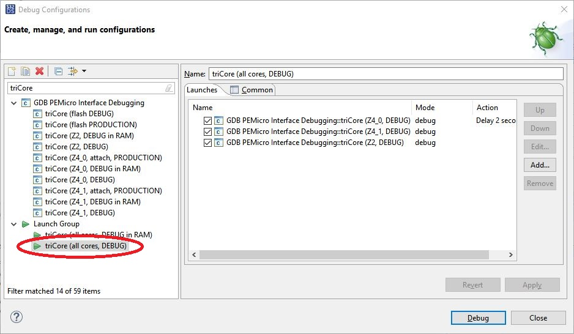

= Flash Boot Loader for DEVKIT-MPC5748G
:Author:            Peter Vranken 
:Email:             mailto:Peter_Vranken@Yahoo.de
:toc:               left
:xrefstyle:         short
:numbered:
:icons:             font
:caution-caption:   :fire:
:important-caption: :exclamation:
:note-caption:      :paperclip:
:tip-caption:       :bulb:
:warning-caption:   :warning:

This repository contains a CAN based flash boot loader (FBL) for the
DEVKIT-MPC5748G. The board dependencies are little, so the FBL will be
applicable in other boards designed around the MP5748G, too.

The FBL supports CAN as only communication channel. The applied protocol
is CCP, details are explained below. A suitable
https://github.com/PeterVranken/winFlashTool/tree/main[flash tool^] is
available in a related repository. It has been made for Windows, but it is
a Java application and should run under Linux, too.

== Key features

- CCP protocol for authorization, erasure, download (programming) and
  upload (read-out or verify)
- Authorization with Ed25519 key pairs
- 224 kB at 0xF90000 reserved for FBL
- 5856 kB at 0xFC8000 managed by FBL and available to application code

== The FBL

The FBL is an ordinary, embedded application for the MPC5748G. It has a
CAN device driver and a flash ROM driver. It integrates elements from the
Open Source CAN stack
https://github.com/PeterVranken/comFramework/wiki[comFramework^] to
implement the
https://kvaser.com/about-can/higher-layer-protocols/ccpxcp/[CCP
protocol^].

The CCP protocol permits another CAN node -- usually a Windows flash tool
-- to establish a communication channel (aka "session") with the
DEVKIT-MPC5748G. The DEVKIT-MPC5748G is the CCP server and the Windows
flash tool is the CCP client. The server provides functionality and the
client can use CCP commands to configure and initiate the execution of the
offered functions. 

The basic idea of CCP is a pair of two CAN messages, called CRO and DTO.
The client sends a CRO message, which encodes a CCP command, including its
arguments. The client decodes the command, executes it and sends the DTO
message back, which encodes the result of the command execution. The core
code structure of the FBL is a state machine implementing the CCP
protocol. Actions are triggered on reception of CAN CRO messages and when
they complete, a DTO message is sent.

The FBL supports only a subset of all CCP commands -- those which are
required for flashing an application (see below). The principal CCP
commands are erasing flash memory blocks and downloading data bytes for
programming. If the client uses unsupported CCP commands then the FBL will
reject them and close the communication channel.

Many of the triggered actions are activities of the flash ROM driver,
e.g., erasing a flash block or programming a flash ROM page. The flash ROM
driver executes in parallel to the CCP state machine. The CCP state
machine is not only triggered by CAN Rx events, but it has timer events
available, too, which allow it to regularly check for the progress of the
concurrent flash ROM driver or to decide on timeout and failure if it is
not responsive. It also checks for potential misbehavior of the CCP
client, which is perceived as protocol error and leads to aborting of the
connection.

Next to CCP protocol state machine and flash ROM driver, is the serial I/O
the third pilar in the code structure. The FBL writes a lot of status and
progress information to the COM port of the DEVKIT-MPC5748G. Moreover, it
reads a couple of commands ("help" to begin) from the COM port and allows
to interact with a user, who has opened a terminal session with the board.
This option strongly supports all development work in the context of the
FBL - be it maintenance work on the FBL itself or development of an
application made or modified for use with the FBL. Beyond development, in
the final product, the serial I/O has no relevance any more.

The FBL occupies a portion of the application flash ROM of the MPC5748G.
Actually, it requires:

.Flash ROM reserved for FBL
[quote]
----
0x00F90000 .. 0x00FC8000 (224 kB)
----

This address range is not available to a flashed application. The
remaining application flash ROM,

.Flash ROM managed by the FBL
[quote]
----
0x00FC8000 .. 0x01580000 (5856 kB, 5.72 MB)
----

can be used for the application. The FBL can erase and re-program this
memory area. The FBL is not able to erase, access or program any other
part of the memories.

In a typical scenario, the FBL is flashed once onto the DEVKIT-MPC5748G
with the debugger in the S32 Design Studio. From now on, the application
and all of its later updates will be flashed with a Windows flash tool and
under control of the FBL. This supports making products based on the
MPC5748G, which allow later firmware update in the workshop or a customer
support center.

TODOC:

. How to configure CAN bus and CCP CRO and TO CAN IDs
. Which CCP commands are supported, supported arguments
. Expected sequence of CCP commands
. Behavior of flashing quad-pages, when is data buffered, when is it written
. Use of command line
. Reset behavior
. Flashing the FBL erases all flash ROM, application is erased, too
. Boot headers

== Tools

=== Environment

==== Command line based build

The makefiles and related scripts require a few settings of the
environment in the host machine. In particular, the location of the GNU
compiler installation needs to be known and the PATH variable needs to
contain the paths to the required tools. 

For Windows users there is a shortcut to PowerShell in the root of this
GitHub project, which opens the shell with the prepared environment.
Furthermore, it creates an alias to the appropriate GNU make executable.
You can simply type `make` from any location to run MinGW32 GNU make.

The PowerShell process reads the script `setEnv.ps1`, located in the
project root, too, to configure the environment. This script requires
customization prior to its first use. Windows users open it in a text
editor and follow the given instructions that are marked by TODO tags.
Mainly, it's about specifying the installation directory of GCC.

Non-Windows users will read this script to see, which (few) environmental
settings are needed to successfully run the build and prepare an according
script for their native shell.

[[secOpenEclipse]]
==== Eclipse for building, flashing and debugging

Flashing and debugging is always done using the NXP S32 Design Studio for
Power Architecture, an Eclipse IDE, which is available for free download
and nearly unrestricted use in commercial and non commercial projects.

If you are going to run the application build from the Eclipse IDE then
the same environmental settings as described above for a shell based build
need to be done for Eclipse, too. The easiest way to do so is starting
Eclipse from a shell, that has executed the script `setEnv.ps1` prior to
opening Eclipse.

For Windows users the script `S32DS-IDE.ps1` has been prepared. This script
requires customization prior to its first use. Windows users open it in a
text editor and follow the given instructions that are marked by TODO
tags. Mainly, it's about specifying the installation directory of
the S32 Design Studio.

Non-Windows users will read this script to see, which (few) environmental
and path settings are needed to successfully run the build under control
of Eclipse and prepare an according script for their native shell.

Once everything is prepared, the S32 Design Studio will never be started
other than by clicking the script `S32DS-IDE.ps1` or its equivalent on
non-Windows hosts.

TODOC: Where to get the tools, how to install them
//See https://github.com/PeterVranken/TRK-USB-MPC5643L[project overview^] and
//https://github.com/PeterVranken/TRK-USB-MPC5643L/wiki/Tools-and-Installation[GitHub
//Wiki^] for more details about downloading and installing the required
//tools.

=== Compiler and makefile

Compilation and linkage are makefile controlled. The compiler is GCC
(MinGW-powerpc-eabivle-4.9.4). It is part of the S32 Design Studio
installation and can be used independently from the Studio. The makefile
is made generic and can be reused for production projects that want to
make use of safe-RTOS. It supports a number of options (targets); get an
overview by typing:
 
    cd <projectRoot>/samples/CAN
    mingw32-make help

The main makefile `GNUmakefile` has been configured for the build of
sample "CAN". Type:

    mingw32-make -sO build
    mingw32-make -sO build CONFIG=PRODUCTION

to produce the flashable files
`bin\ppc\default\DEBUG\DEVKIT-MPC5748G-CAN.elf`, and
`bin\ppc\default\PRODUCTION\DEVKIT-MPC5748G-CAN.elf`.

File `GNUmakefile` has a variable `defineList`, which is a list of options
for the build. A major option is `LINK_IN_RAM`. If you place this option
into the list then the same build commands link the software for execution
in RAM. (See next section for details). With option `LINK_IN_RAM`, the same
commands:

    mingw32-make -sO build
    mingw32-make -sO build CONFIG=PRODUCTION

produce the flashable files
`bin\ppc\default\DEBUG-RAM\DEVKIT-MPC5748G-CAN.elf`, and
`bin\ppc\default\PRODUCTION-RAM\DEVKIT-MPC5748G-CAN.elf`.

To get more information, type:

    mingw32-make --help
    mingw32-make help

WARNING: The makefile requires the MinGW port of the make processor. The
Cygwin port will fail with obscure, misleading error messages. For your
convenience, we have uploaded an appropriate recent version of the MinGW
make processor into this GitHub project. The PowerShell startup script
aliases this (Windows) executable to the command `make`. Moreover,
explicitly typing `mingw32-make` will generally avoid any problem.

The makefile is designed to run on different host systems but has been
tested with Windows 7 and Windows 10 only.

[[secRunInRAM]]
=== Running your application in RAM

The makefile and the linker scripts support the location of the code
entirely in RAM. The MPC5748G has plenty of RAM so that even large pieces
of code can be loaded and executed in RAM. This is extremely helpful for
code development. Loading the code into the device's RAM is significantly
faster than into ROM and many flash erase and program cycles can be saved.
Even if your complete project may not fit into RAM then you may still
consider it useful to build some sub-modules together with their testing
code in this way.

Nothing particular has to be done to load a compiled software into RAM.
The GNU debugger in the Design Studio just looks at the addresses of code
and data objects in the binary file (`*.elf`). It'll erase and flash the
ROM if the objects have ROM addresses and it'll load them into RAM if the
objects are located in RAM. So all we have to do is defining the memory
addresses in the linker scripts accordingly in the one or the other way.

Under control of a macro in the main makefile, `GNUmakefile`, the linker
chooses different address ranges. If the macro `LINK_IN_RAM` is element of
the list of macros then the linker will divide the physically available
RAM into 67% for code or text and constant data sections (512k) and 33%
for data sections (256k). If the macro is not defined in the list then all
768k of RAM are available to the data sections.

The macro is seen by the C source code at compile-time, too. However,
there are barely dependencies. The MPU configuration is the principal
exception and some execution timing operations are dependent on the macro,
too.

To switch between linkage in ROM or RAM, open file `GNUmakefile` in a text
editor and look for the definition of variable `defineList`. The left hand
side expression is a blank-separated list of symbols, which are passed to
the compiler and linker as preprocessor #define. Add `LINK_IN_RAM` if
you want to run your code in RAM.

WARNING: Running the software in RAM is useful but, by principle, a
preliminary, temporary way of working only. Running the software can be done
only under control of the debugger, which is needed to load the binary
data into the MCU's RAM. A start of the software out of reset or after a
power-up or without connected Design Studio is impossible.

=== Flashing and debugging

The code of this DEVKIT-MPC5748G sample can be flashed and debugged with
the S32 Design Studio IDE. Effectively, flashing means to start the GNU
debugger (GDB) and to let it "load" the *.elf file. If the code is linked
in flash ROM address space then this loading means writing to the flash.
Consequently, a flash configuration in the Eclipse IDE is nearly identical
to any ordinary debug configuration, just the option "Load executable" to
load a file is checked. Ordinary debug configurations, i.e. for debugging,
don't have this check mark set:

[[figDebugConfigFlash]]
.Eclipse debug configuration, which is used for flashing
image::readMe_resources/debugConfigForFlashing.jpg[Eclipse debug configuration, which is used for flashing, width="70%", pdfwidth="70%", align="center"]

Connect your evaluation board DEVKIT-MPC5748G with the USB wire and start
the S32 Design Studio as outlined above (<<secOpenEclipse>>). Now you can
find the debug configuration shown in <<figDebugConfigFlash>> in menu
"Run/Debug Configurations..." A dialog listing all available debug
configurations opens. Type "flash" in the text box, which initially has
the focus, to filter all of them, which are intended for flashing and
select the one you need. Press the Enter key or click on button "Debug"
and the flash process begins. Progress and status messages are printed in
one of the console windows in the lower right corner.

It's a bit counter-intuitive that flashing with GDB is just a kind of side
effect of starting the debugger. Rather than with a "Congratulations,
flashing successfully completed"-message, flashing ends with a ready to
use interactive debug session: The source code window shows the startup
code for the boot core Z4A and you could go ahead and step through the
just flashed code. However, you won't typically do so and rather stop this
debug session again. This is why:

In the S32 Design Studio, a debug session for projects running _n_ cores
requires opening a combination of _n_ Eclipse debug configurations, one
for each core. Such a combination is called a "Launch Group". Our flash
configurations generally use only a single debug configuration, because
our project links all the code in one *.elf file, regardless of the number
of cores, which are in use. Therefore, if you'd really go ahead with the
flash debug session then you could only control and observe boot core Z4A.
Better to close it again and start a more appropriate Launch Group.

[[figLaunchGroup]]
.Debug configuration to chose when debugging a multi-core software

If you built your software for execution in RAM (see <<secRunInRAM>>) then
you don't need to flash. No matter what is currently flashed, just start
the according debug configuration. The RAM is loaded with your software
and you can start it with the usual debugger commands to step and run,
etc. If you end the debug session while the cores are all running (i.e.
none of the cores is halted in a breakpoint) then the software in RAM even
stays alive and can be observed without debugger connection. Only after
next reset the ROM software will take effect again.

By the way, the debug sessions can be found also by a click on the black
triangle next to the blue icon "bug". The last recently used
configurations are listed in the menu. To see all of them or to
double-check their properties you'd click "Debug Configurations...",
somewhere down below the list. In the new dialog, select the wanted one
and start the debugger with a last click on button "Debug".

== Known issues

. Debugger: If the view shows the INTC0 register set then the debugger
harmfully affects program execution and the RTOS fails: The write to
INTC_EOIR_PRC0, which normally restores the current priority level
INTC_CPR_PRC0, now fails to do so. The complete interrupt handling fails
from now on. Mostly the effect is that the OS tick interrupt, which has a
high priority, leaves this high priority level set in the INTC_CPR_PRC0,
so that effectively no interrupts (including itself) are handled any more.
Only the code of the idle task is executed any longer.
+
Workaround: Don't open the view of the INTC0 in the debugger when
debugging a safe-RTOS application. Then the INTC and the code work fine.

. Debugger: A similar effect has been observed with the instructions to
alter the External Interrupt enable bit, MSR[EE]. Do not single-step in
the debugger over wrtee(i) instructions. The instruction may fail to
change the bit. If the code approaches such an instruction you should use
the right-click operation "Run to line", targeting the instruction behind
the wrtee(i). This works fine.

. Debugger: A similar effect has been observed when putting a breakpoint
on the first instruction of an exception handler. (Which is indeed a
natural desire to be informed about exceptions.) The correct exception
handling is confused. The CPU state is not correctly stored in the xSRRi
registers and the MSR bits are not properly updated, at least not the
External Interrupt enable bit, MSR[EE]. Further software execution has
barely a chance. Workaround is to set the breakpoint a few instructions
further on in the exception handler.

. Debugger: It is not possible to hinder the P&E debugger from halting at
an se_illegal instruction. (See https://community.nxp.com/thread/497533)
This makes it impossible to debug the fault catching capabilities of the
RTOS. All severe code errors, which lead to the execution of an arbitrary
address, will sooner or later encounter a zero word in the instruction
stream and the debugger will break -- before the RTOS can catch the error.
It is possible to continue the code execution from the debugger and to
see, what the RTOS will do but this is an interactive process and
systematic testing of error catching code is not possible this way. We can
only do it without connected debugger.